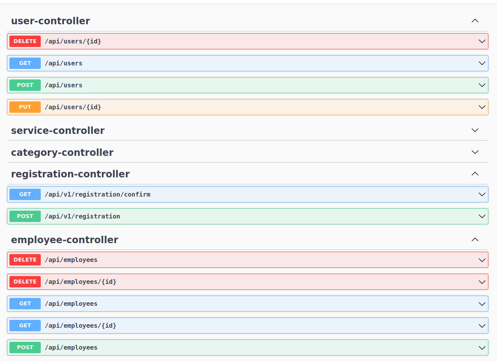

# Reservation online service - backend

---

## Technology stack

* Java 17
* Spring Boot
* Hibernate
* Maven
* Junit 5
* Lombok
* MySQL
* Spring Security
* Swagger UI

## Future features

## REST API Documentation:
http://localhost:8080/swagger-ui.html

## How to run

### Status
Project is in progress.
